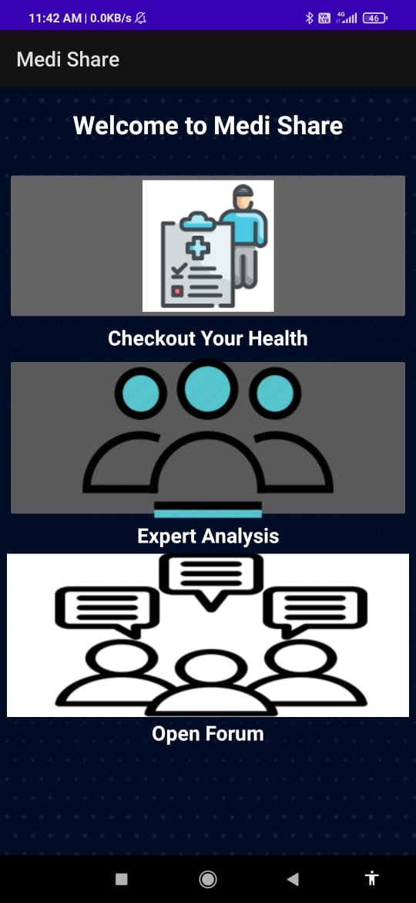
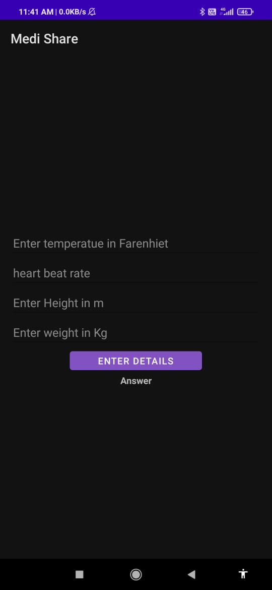
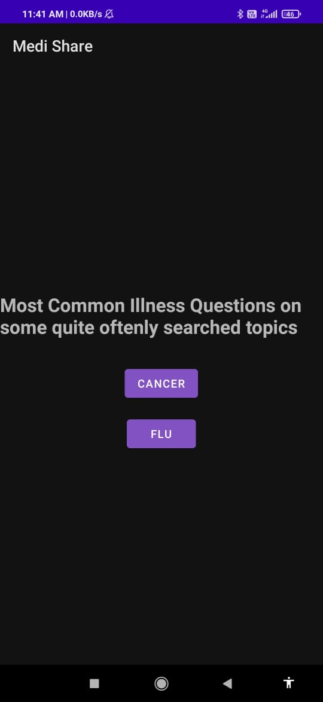
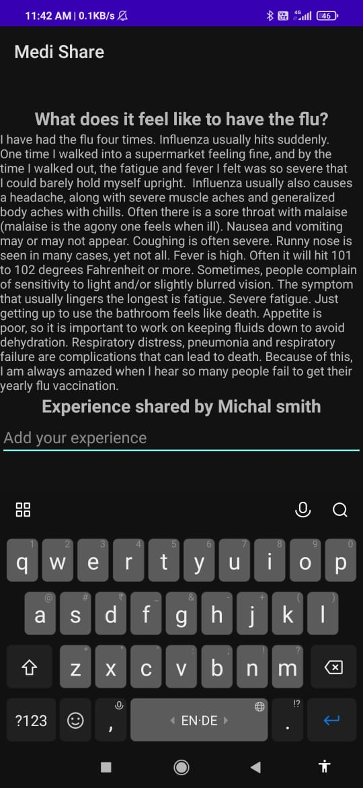

# Medi Share
Medi Share, an application that drives an "Expo Forum", an expert driven community forum.

## About

### _Health Articles:_ 
Expert Curated health articles that anwer the most important questions.
### _Discussion Forums:_ 
Open for all discussion forum, where anyone can come forward to share their medical experiences.
### _Health Tracker_:
An inbuilt tracker, that can predict any medical condition, thus preventing it
### _Doctor Directory_:
A platform to connect with doctors, hospitals and medical dispenseries

## MVP
Our MVP is our "Expo Forum", an expert driven community forum. It provides convenience to our users, reliable information, personalized recommendations and support.

## Our App Screenshots

### Home Screen

### Health Tracker

### Expert Forum

### Open Forum

## Installation

1. Clone the repository or download the zip file.
2. Open the project in Android Studio.
3. Build and run the app on an Android emulator or device.

## Requirements

- Android Studio 4.0 or later
- Android SDK 29 or later
- JDK 8 or later

## Libraries Used

- [Insert library names here]

## Licenses

MyApp is released under the GNU General Public License v3.0 (GPL-3.0) license.

The GPL is a free, copyleft license for software and other kinds of works. By "copyleft," the GPL grants the recipients of a program the rights to modify and distribute it under the same license terms as the original program. This means that any modifications or derivatives of MyApp must also be released under the GPL license.

For more information on the GPL license, see the GNU website.

## Contributing

Contributions to MyApp are welcome. To contribute, please follow these steps:

1. Fork this repository.
2. Create a new branch.
3. Make your changes and commit them.
4. Push your changes to your fork.
5. Create a pull request.

## Credits

Medi Share was co-developed by [Anandan](https://github.com/anandanmukh).

